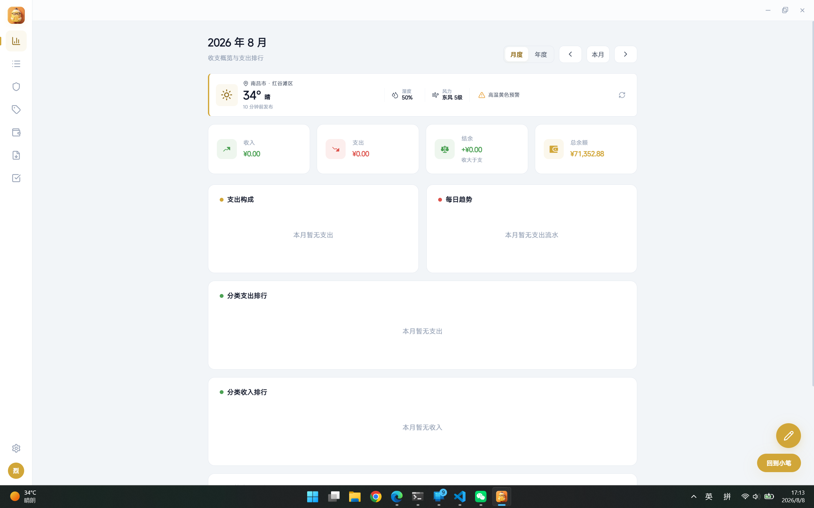
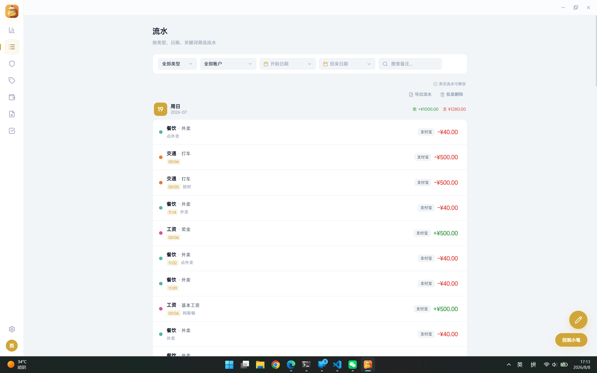
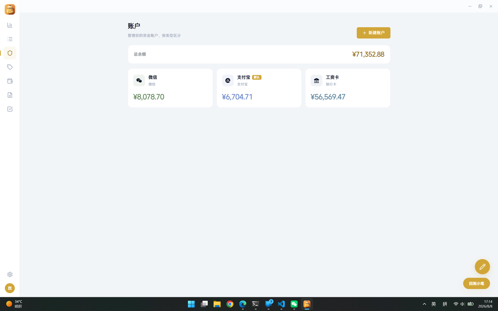
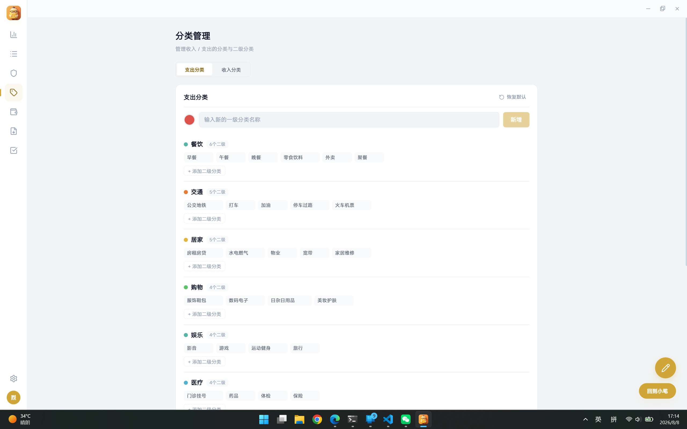
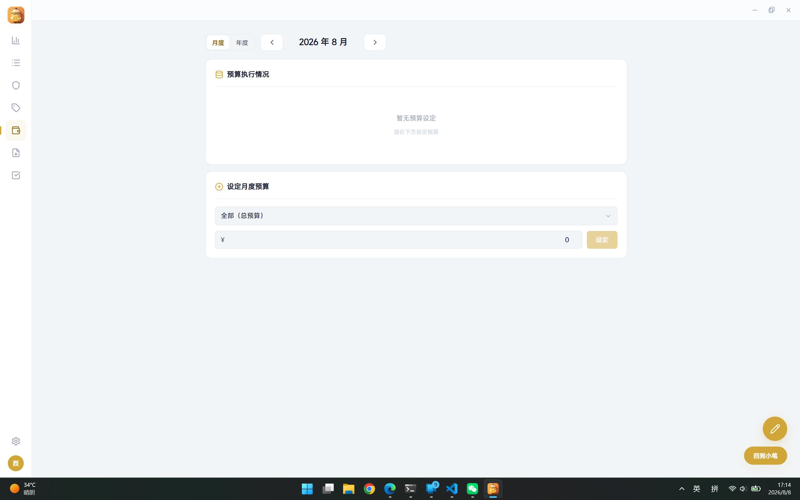
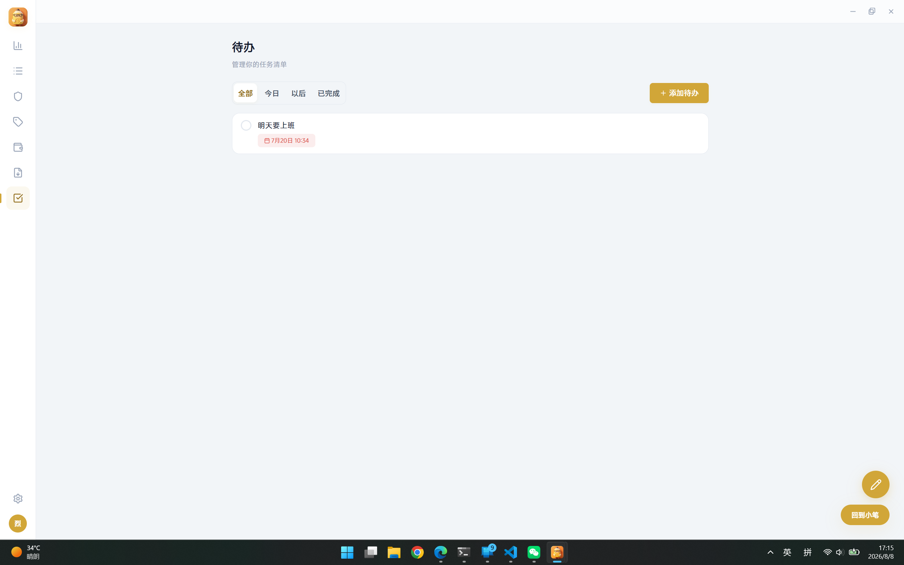
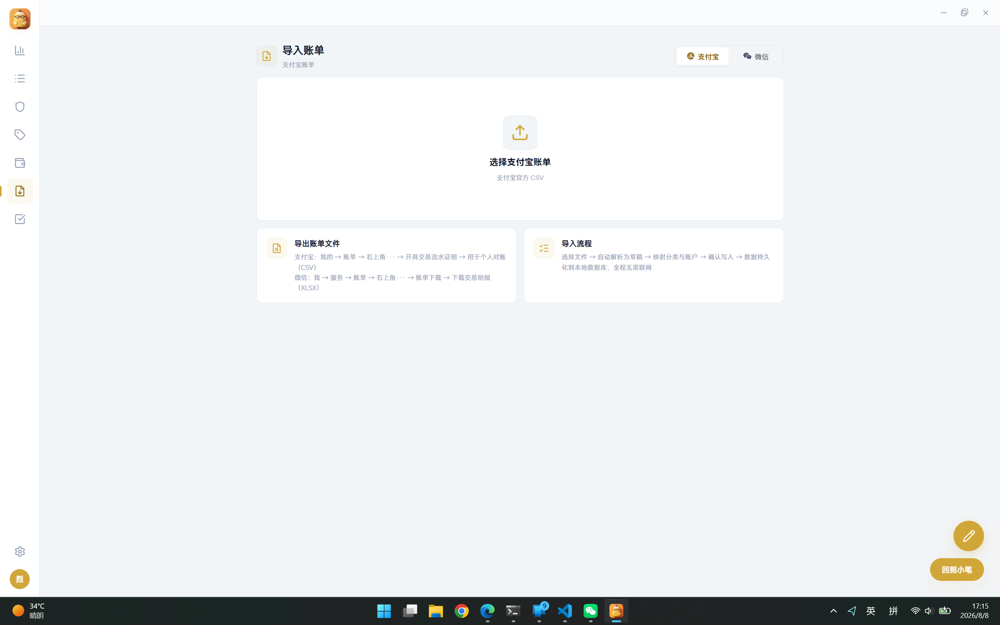
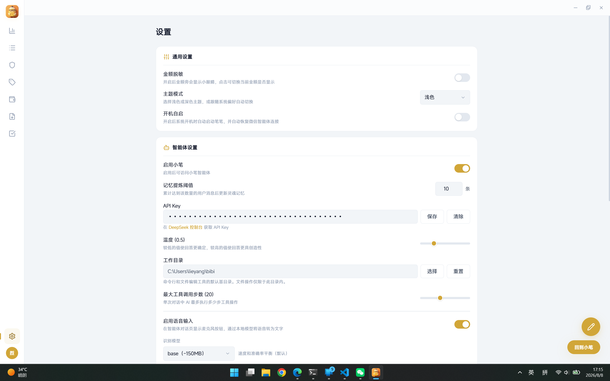
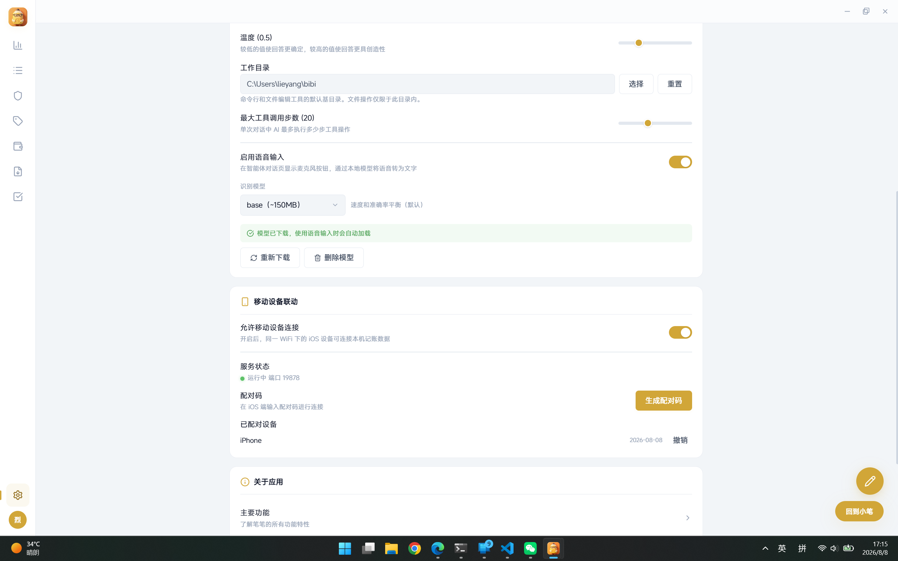

# 笔笔（bibi）

> **官网**：[lieyangx.github.io/bibi](https://lieyangx.github.io/bibi/) ｜ **仓库**：[github.com/LieYangX/bibi](https://github.com/LieYangX/bibi)

个人记账桌面应用（Electron + Vue 3 + TypeScript），内置 AI 记账助手，并可作为局域网内 iOS 端的"电脑端大脑"——通过 Bonjour 广播 + HTTP API 向手机端提供记账工具能力。

## 功能特性

- **记账管理**：流水、账户、分类（含二级分类）、预算、统计图表（ECharts）
- **账单导入**：支付宝 CSV 与微信账单 XLSX 草稿式导入（解析 → 分类/账户映射 → 明细复核 → 事务化入库，按交易号防重）
- **AI 智能体**：DeepSeek（Vercel AI SDK），5 个内置 Skill（数据查询 / 计算器 / 报表 / 分析 / 记账写入），支持自定义 Skill 与 MCP 服务器扩展
- **语音输入**：Whisper ONNX 本地推理（独立 worker_thread），繁体自动转简体
- **微信渠道**：扫码登录后通过微信与智能体对话
- **手机联动（Tool Server）**：开启后在局域网广播服务，iOS 端发现后配对，即可在手机上调用电脑端记账工具

## 界面预览

<p align="center">
    
    
</p>
<p align="center">
    
    
</p>
<p align="center">
    
    
</p>
<p align="center">
    
    
</p>
<p align="center">
    
</p>

## 技术栈

| 分类 | 选型 |
|------|------|
| 桌面框架 | Electron 39 + electron-vite 5 + electron-builder 26 |
| 前端 | Vue 3.5 + TypeScript 5.9 + Vite 7 + Pinia + Vue Router |
| 数据库 | SQLite（better-sqlite3）+ Drizzle ORM，12 张表 |
| AI | Vercel AI SDK + @ai-sdk/deepseek（默认 `deepseek-v4-flash`） |
| STT | @huggingface/transformers（Whisper ONNX，本地推理） |
| 微信 | @pinixai/weixin-bot |
| MCP | @ai-sdk/mcp，运行时动态连接加载工具 |
| 图表 | ECharts 6 + vue-echarts |
| 服务发现 | bonjour-service（局域网广播） |
| 校验 | Zod（IPC 参数 + HTTP 请求参数） |

## 与 iOS 端联动

仓库 [bibi-ios](https://github.com/LieYangX/bibi-ios) 是配套的 iOS 端（SwiftUI）。两端通过 **Tool Server** 联动：

```
┌──────────────────────────┐            ┌──────────────────────────┐
│  bibi-ios（手机）         │            │  bibi（电脑）             │
│  SwiftUI · iOS 26        │            │  Electron · Vue 3        │
│                          │  ① 发现    │                          │
│  NetServiceBrowser ──────┼───────────→│  Bonjour 广播            │
│  搜索 _bibi-tools._tcp   │            │  _bibi-tools._tcp:19877  │
│                          │  ② 配对    │                          │
│  POST /api/v1/pair ──────┼───────────→│  6 位配对码（300s 有效）  │
│  （配对码 + 设备名）      │  ③ 认证调用│  Bearer Token 鉴权        │
│  GET  /api/v1/tools ─────┼───────────→│  动态工具列表             │
│  POST /api/v1/tools/:name┼───────────→│  AI 工具执行 → 记账数据   │
│                          │            │  HTTP :19878             │
└──────────────────────────┘            └──────────────────────────┘
```

### Tool Server 说明

- **开关**：设置页开启后，主进程内启动 Express HTTP 服务（端口 `19878`）并广播 Bonjour 服务（`bibi-<用户名>`，类型 `_bibi-tools._tcp`，端口 `19877`，TXT 携带 `http_port` / `version` / `user`）
- **接口**：`/api/v1/pair`（无需认证）| `/ping`、`/users`、`/tools`、`/devices`（需 Bearer Token）
- **配对**：生成 6 位配对码（300 秒过期），iOS 端携码调用 `/pair` 换取 Token；配对设备持久化，可单独撤销
- **工具来源**：动态导出当前已启用 Skill 的工具（含 JSON Schema 参数定义），与 PC 端 AI 智能体共用同一工具注册表
- **鉴权**：除 `/pair` 外所有接口经 `authMiddleware` 校验 Bearer Token；CORS 允许局域网内所有来源

## 项目结构

```
src/
  main/                   # Electron 主进程
    index.ts              # 最小入口：调用 bootstrapApplication()
    app/                  # 生命周期与启动编排
    windows/              # BrowserWindow 创建与 Web 安全策略（sandbox + contextIsolation）
    workers/              # stt.worker.ts（Whisper ONNX 推理，独立线程）
    database/             # better-sqlite3 连接、Drizzle schema、迁移运行器
    services/             # 领域逻辑：账单导入、账户、预算、统计、待办、语音等
    ipc/                  # IPC 统一处理：可信来源校验、Zod 参数校验、异常映射
    agent/                # AI 编排：orchestrator、LLM 网关、Skill 注册表、MCP、微信渠道
    tool-server/          # 手机联动：Express HTTP + Bonjour 广播 + 配对鉴权 + 工具路由
  preload/                # contextBridge 最小化能力桥接
  renderer/               # Vue 3 前端（Pinia 8 个 store、Bb 组件库、--bb-* 设计 token）
  shared/                 # 三进程共享：IPC 频道、DTO、安全校验
tests/
  unit/                   # 纯 TypeScript 单元测试（Vitest）
  integration/            # Electron ABI 数据库集成测试
scripts/                  # 图标生成、onnxruntime 清理
```

## 开发命令

```bash
npm install          # 首次安装（自动重建 better-sqlite3 为 Electron ABI）

npm run dev          # 开发模式
npm run check        # 完整质量门禁：format + lint + typecheck + test + test:db
npm run build        # 生产构建
npm run build:win    # 生成 Windows 安装包
```

> `better-sqlite3` 针对 Electron ABI 构建，数据库集成测试必须使用 `npm run test:db`，不要用宿主 Node.js 直接运行。

## 数据库与迁移

- 开发库 `bibi-dev.db`，生产库 `%APPDATA%/笔笔/bibi.db`；WAL 模式、外键开启、单实例锁
- 金额统一以**分**存储；流水软删除
- 迁移工作流：修改 `schema.ts` → `npx drizzle-kit generate` → `npm run build`（自动复制 SQL）→ 启动时按序执行未应用迁移，每个迁移独立事务
- 12 张表：用户、账户、分类（二级）、流水、导入映射与去重引用、预算、设置、智能体会话与消息

## 相关项目

- **星枢（bibi-ios）**：配套 iOS 端（SwiftUI + iOS 26），通过 Tool Server 调用本应用的记账工具。详见 [bibi-ios 仓库](https://github.com/LieYangX/bibi-ios) 与 [星枢官网](https://lieyangx.github.io/bibi-ios/)。

## 注意事项

- 无 CI，`npm run check` 是唯一质量门禁，每次交付前必须通过
- `.npmrc` 已将 Electron / electron-builder 二进制镜像配置为 npmmirror（国内网络）
- `resources/icon.png` 必须存在才能执行 build 命令（图标生成）
- 开发产物（`bibi-dev.db`、`logs/`、`stt-cache/` 等）已被 `.gitignore` 排除
